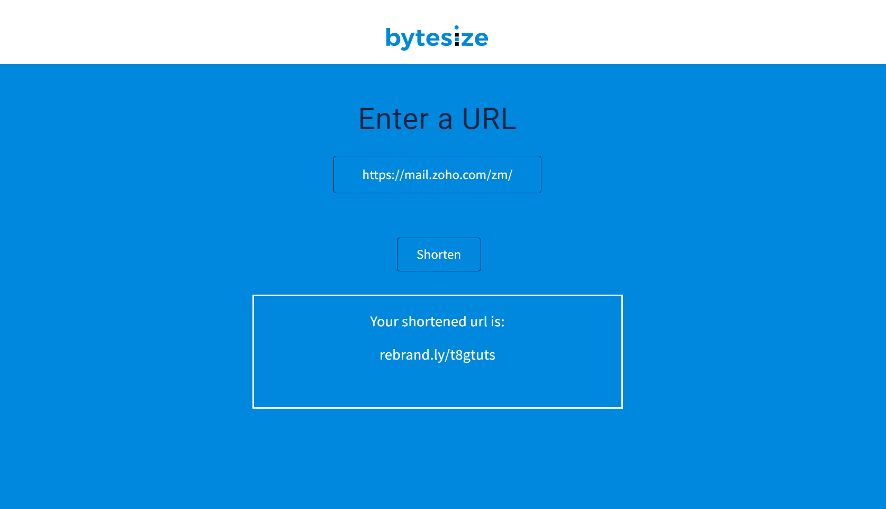

# Bite Size
Welcome to **BiteSize**! BiteSize is a **JavaScript** project that allows users to shorten urls into a more condensed form. Think of it as your personal url shortener! 🙂 This project operates by making requests to [Rebrandly URL Shortener API](https://developers.rebrandly.com/) which returns the shortened version of the URL. Let's dive in the code!

## Getting Started
1. Open your terminal and run: `git clone https://github.com/khalilgreenidge/BiteSize.git`
2. Go to [Rebrandly's website](https://developers.rebrandly.com/) to signup for an account in order to obtain an API key.
3. Go to line 2 in [main.js](main.js) and assign your given api key to `apiKey` on line 2.
4. Open `index.html` in your favourite browser. You should see a screen that looks like below.
5. Paste a url into the field and click the **Shorten** button. 
6. Have fun! 😎

